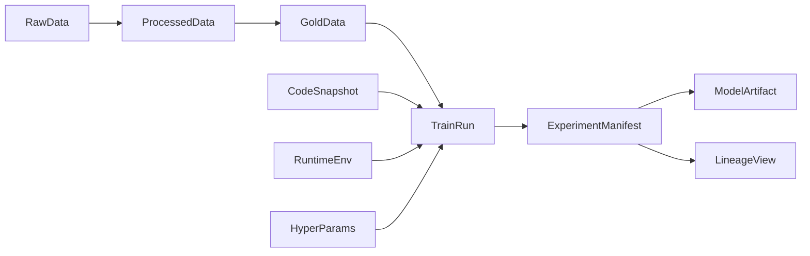

# mlspace

`mlspace` 是一个基于百度百舸 AI 计算平台进行业务实践的本地化业务素材、资产、方法与最佳实践管理工具。
它本质上是一个本地目录，目录结构映射百舸平台的各个业务模块，用于存放每个模块对应业务的文件，例如模板、文档、记录、示例、实践笔记和辅助脚本。

## 产品定位

`mlspace` 不是一个单纯的训练代码仓库，也不是一个零散资料集合。
它的目标是把围绕百舸平台开展业务时会反复出现的内容，按平台业务模块和横向资料进行本地化管理，例如：

- 某个 `ResourcePool` 或 `Queue` 的使用说明、经验记录和模板
- 某类分布式训练 `Job` 的配置范式、启动脚本和最佳实践
- `DevInstance` 开发机的环境准备、镜像使用和操作手册
- `WorkFlow` 的编排资料、流程说明和交付记录
- `Dataset`、`Model`、`Image` 等 AI 资产的规范、模板和示例
- 横向的 `Tool`、SDK、OpenAPI 说明和集成资料

## 为什么按百舸模块组织

机器学习业务团队在使用百舸平台时，天然是按平台模块理解和沉淀知识的，而不是按抽象技术分层来找资料。
因此 `mlspace` 的目录结构优先映射百舸业务模块，再补充少量横向资料目录，保证“在哪个模块工作，就去哪个目录沉淀内容”。

## 百舸业务模块映射

当前仓库目录与百舸业务模块的对应关系如下：

- `ai_compute_resource/resource_pool/`：对应 AI 计算资源中的 `ResourcePool`
- `ai_compute_resource/queue/`：对应 AI 计算资源中的 `Queue`
- `job/`：对应分布式训练 `Job`，承载训练模板、训练约定和训练实践
- `dev_instance/`：对应开发机 `DevInstance` 的环境准备、使用说明和实践约定
- `workflow/`：可承接 `WorkFlow` 或业务流程模板，也用于沉淀项目级落地模板
- `ai_asset/dataset/`：对应 AI 资产中的 `Dataset`
- `ai_asset/model/`：对应 AI 资产中的 `Model` 产物、权重、导出物与交付规范
- `ai_asset/image/`：对应 AI 资产中的 `Image`

横向资料目录如下：

- `references/tool/`：横向常用工具资料
- `references/sdk/`：横向 SDK 资料与集成样例
- `references/openapi/`：横向 OpenAPI 说明资料
- `notebooks/`：横向实践资料目录，用于放探索性 notebook 和操作样例
- `generated_local/`：本地产生的缓存、演示输出和示例产物
- `governance/`：横向治理目录，用于沉淀 manifest、lineage 和可审计记录

## 核心使用原则

为了让本地资料和百舸平台模块一一对应，建议遵循以下原则：

1. 业务模块优先：能明确归到某个百舸业务模块的内容，优先放到对应模块目录。
2. 横向资料独立：`Tool`、SDK、OpenAPI、探索性 notebook 等跨模块内容，放到横向目录。
3. 素材与资产并重：不仅放代码，也放模板、说明文档、记录、参数样例、经验总结和交付清单。
4. 本地化沉淀：`mlspace` 是本地目录，强调业务资料的长期收纳、复用和查找效率。

## 百舸目录导航

### 百舸业务模块

- `ai_compute_resource/`：AI 计算资源主目录，下分 `resource_pool/` 与 `queue/`
- `job/`：分布式训练 `Job` 相关模板、实践和说明
- `dev_instance/`：开发机 `DevInstance` 相关环境与使用说明
- `workflow/`：`WorkFlow` 或项目流程模板、业务模板和落地骨架
- `ai_asset/`：AI 资产主目录，下分 `dataset/`、`model/`、`image/`

### 横向资料目录

- `references/`：横向资料主目录，下分 `tool/`、`sdk/`、`openapi/`
- `notebooks/`：探索性 notebook、实验样例和操作记录
- `governance/`：manifest、lineage、审计记录等横向治理资料
- `serving/`：当前用于承载推理兼容、上线前检查等服务相关资料
- `generated_local/`：本地生成的缓存、演示输出和临时产物

## 以 Governance 为中心的工作流

`governance/manifest` 是训练、评测、发布等关键运行的统一记录协议。
每一次有意义的训练、评测或产物发布，都应该留下对应记录。

## 快速开始

1. 先确定你沉淀的内容对应哪个百舸业务模块。
2. 如果对应 `ResourcePool`、`Queue`、`Job`、`DevInstance`、`WorkFlow`、`Dataset`、`Model`、`Image`，放入对应业务模块目录。
3. 如果内容属于 `Tool`、SDK、OpenAPI 说明或跨模块实践，放入横向资料目录。
4. 如果内容涉及关键实验、产物发布或流程审计，同时补充 `governance/manifest/experiment_log.json` 一类记录。
5. 对于本地生成的缓存或演示输出，统一归档到 `generated_local/`。

## 推荐阅读路径

如果你正在基于百舸平台组织本地业务资料，建议按下面顺序阅读：

1. 先看 `ai_compute_resource/`、`job/`、`dev_instance/`，理解百舸核心计算与研发模块。
2. 再看 `ai_asset/`，理解 `dataset/`、`model/`、`image/` 三类 AI 资产如何组织。
3. 如果需要业务落地模板，再看 `workflow/`。
4. 如果需要 SDK、工具链或接口说明，再看 `references/`。
5. 如果需要实践样例，再看 `notebooks/`。
6. 最后用 `governance/` 管理关键记录和可追溯信息。

## 目录迁移说明

旧结构已经按平台功能域重组，主要映射如下：

- `data_standard/` -> `ai_asset/dataset/`
- `train_templates/` -> `job/`
- `train_templates/inference_compat/` -> `serving/compatibility/`
- `tools/env/` -> `dev_instance/env/`
- `tools/sync/` -> `ai_asset/dataset/sync/`
- `tools/setup_registry.sh` -> `ai_asset/image/setup_registry.sh`
- `infrastructure/docker/` -> `ai_asset/image/docker/`
- `infrastructure/k8s_sidecar/` -> `ai_compute_resource/resource_pool/k8s_runtime/`
- `business_manifest/` -> `governance/manifest/`
- `business_manifest/lineage_tracker/` -> `governance/lineage/`

## 当前范围

当前仓库主要承载以下内容：

- 百舸业务模块对应的本地目录骨架
- 模板、文档、记录、示例与最佳实践说明
- 横向工具、SDK 与 OpenAPI 相关资料目录
- 用于治理关键实验和产物的 manifest 示例

当前暂不强调的内容：

- `mlspace init` 与 `mlspace check` CLI
- GitHub Actions 自动化校验
- 可直接运行的训练框架代码骨架

## 关于现有内容

仓库中已有的 notebook、AIHC SDK 示例和本地 Lance 实验产物，已经按“百舸业务模块 + 横向资料目录”的方式完成重组：

- 各类 notebook 已迁入 `notebooks/`
- AIHC SDK 示例已迁入 `references/sdk/aihc-python-sdk/`
- Lance 安全示例脚本已迁入 `ai_asset/dataset/examples/lance/`
- 本地生成的 Lance 数据和缓存已迁入 `generated_local/lance_local/`

这样既保留了可复用业务资产，也让本地目录结构更贴近百舸平台的实际使用心智。
