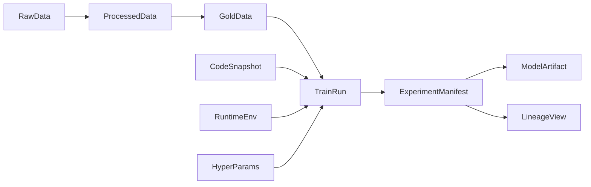

# mlspace

`mlspace` 是一个基于百度百舸 AI 计算平台进行业务实践的本地化业务素材、资产、方法与最佳实践管理工具。搭配百舸 CLI 工具使用，可高效管理云端资源与本地资产，实现本地化业务资料与百舸平台的无缝协作。它本质上是一个本地目录，目录结构映射百舸平台的各个业务模块，用于存放每个模块对应业务的文件，例如模板、文档、记录、示例、实践笔记和辅助脚本。

## 产品定位

`mlspace` 不是一个单纯的训练代码仓库，也不是一个零散资料集合。
它的目标是把围绕百舸平台开展业务时会反复出现的内容，按平台业务模块和横向资料进行本地化管理，例如：

- 某个 `ResourcePool` 或 `Queue` 的使用说明、经验记录和模板
- 某类分布式训练 `Job` 的配置范式、启动脚本和最佳实践
- `DevInstance` 开发机的环境准备、镜像使用和操作手册
- `WorkFlow` 的编排资料、流程说明和交付记录
- `Dataset`、`Model`、`Image` 等 AI 资产的规范、模板和示例
- 横向的 `Tool`、SDK、OpenAPI 说明和集成资料

## 为什么按百舸模块组织

机器学习业务团队在使用百舸平台时，天然是按平台模块理解和沉淀知识的，而不是按抽象技术分层来找资料。
因此 `mlspace` 的目录结构优先映射百舸业务模块，再补充少量横向资料目录，保证“在哪个模块工作，就去哪个目录沉淀内容”。

## 百舸业务模块映射

当前仓库目录与百舸业务模块的对应关系如下：

- `01ai_compute_resource/resource_pool/`：对应 AI 计算资源中的 `ResourcePool`
- `01ai_compute_resource/queue/`：对应 AI 计算资源中的 `Queue`
- `03job/`：对应分布式训练 `Job`，承载训练模板、训练约定和训练实践
- `02dev_instance/`：对应开发机 `DevInstance` 的环境准备、使用说明和实践约定
- `05workflow/`：可承接 `WorkFlow` 或业务流程模板，也用于沉淀项目级落地模板
- `06ai_asset/dataset/`：对应 AI 资产中的 `Dataset`
- `06ai_asset/model/`：对应 AI 资产中的 `Model` 产物、权重、导出物与交付规范
- `06ai_asset/image/`：对应 AI 资产中的 `Image`

横向资料目录如下：

- `07references/tool/`：横向常用工具资料
- `07references/sdk/`：横向 SDK 资料与集成样例
- `07references/openapi/`：横向 OpenAPI 说明资料
- `08notebooks/`：横向实践资料目录，用于放探索性 notebook 和操作样例
- `04service/`：用于承载推理兼容、上线前检查等服务相关资料
- `09fastapp/`：快速应用开发相关资料，包含开发、作业、服务和工具等内容

## 核心使用原则

为了让本地资料和百舸平台模块一一对应，建议遵循以下原则：

1. 业务模块优先：能明确归到某个百舸业务模块的内容，优先放到对应模块目录。
2. 横向资料独立：`Tool`、SDK、OpenAPI、探索性 notebook 等跨模块内容，放到横向目录。
3. 素材与资产并重：不仅放代码，也放模板、说明文档、记录、参数样例、经验总结和交付清单。
4. 本地化沉淀：`mlspace` 是本地目录，强调业务资料的长期收纳、复用和查找效率。

## 百舸目录导航

### 百舸业务模块

- `01ai_compute_resource/`：AI 计算资源主目录，下分 `resource_pool/` 与 `queue/`
- `03job/`：分布式训练 `Job` 相关模板、实践和说明
- `02dev_instance/`：开发机 `DevInstance` 相关环境与使用说明
- `05workflow/`：`WorkFlow` 或项目流程模板、业务模板和落地骨架
- `06ai_asset/`：AI 资产主目录，下分 `dataset/`、`model/`、`image/`

### 横向资料目录

- `07references/`：横向资料主目录，下分 `tool/`、`sdk/`、`openapi/`
- `08notebooks/`：探索性 notebook、实验样例和操作记录
- `04service/`：推理兼容、上线前检查等服务相关资料
- `09fastapp/`：快速应用开发相关资料，包含开发、作业、服务和工具等内容

## 以 Governance 为中心的工作流

业务实践中的关键运行记录统一沉淀在对应模块目录下，例如训练、评测、发布等关键运行都应该留下对应记录。

## 快速开始

1. 先确定你沉淀的内容对应哪个百舸业务模块。
2. 如果对应 `ResourcePool`、`Queue`、`Job`、`DevInstance`、`WorkFlow`、`Dataset`、`Model`、`Image`，放入对应业务模块目录（`01ai_compute_resource/`、`03job/`、`02dev_instance/`、`05workflow/`、`06ai_asset/` 等）。
3. 如果内容属于 `Tool`、SDK、OpenAPI 说明或跨模块实践，放入横向资料目录（`07references/`、`08notebooks/`）。
4. 如果内容涉及服务部署、推理兼容等，放入 `04service/` 目录。
5. 如果内容涉及快速应用开发，放入 `09fastapp/` 目录。
6. 对于关键实验和产物发布，在对应模块目录下记录 manifest 和 lineage 信息。

## 推荐阅读路径

如果你正在基于百舸平台组织本地业务资料，建议按下面顺序阅读：

1. 先看 `01ai_compute_resource/`、`03job/`、`02dev_instance/`，理解百舸核心计算与研发模块。
2. 再看 `06ai_asset/`，理解 `dataset/`、`model/`、`image/` 三类 AI 资产如何组织。
3. 如果需要业务落地模板，再看 `05workflow/`。
4. 如果需要服务部署相关内容，再看 `04service/`。
5. 如果需要快速应用开发相关内容，再看 `09fastapp/`。
6. 如果需要 SDK、工具链或接口说明，再看 `07references/`。
7. 如果需要实践样例，再看 `08notebooks/`。

## 百舸 CLI 工具集成

`mlspace` 可与百舸 CLI 工具配合使用，提升本地与云端的协作效率：

### CLI 工具定位

百舸 CLI 工具提供了命令行方式操作百舸平台的能力，包括但不限于：
- 资源池和队列管理
- 分布式训练任务的提交与监控
- 开发机的创建与连接
- 数据集、模型、镜像等 AI 资产的管理
- 工作流的编排与执行

### 配合使用的建议

1. **配置管理**：在 `mlspace` 的各模块目录中存放 CLI 配置文件和脚本模板
2. **命令历史**：在对应模块目录下记录关键的 CLI 操作历史
3. **脚本化流程**：将常用的 CLI 命令序列封装为脚本，存放在相应模块目录
4. **文档化实践**：在对应模块的 README 中记录 CLI 工具的最佳实践和注意事项

### 典型使用场景

- 在 `01ai_compute_resource/resource_pool/` 中存放资源池查询和分配的 CLI 脚本
- 在 `03job/` 中存放训练任务提交、监控和管理的 CLI 命令示例
- 在 `06ai_asset/dataset/` 中存放数据集上传、同步的 CLI 操作脚本
- 在 `02dev_instance/` 中存放开发机环境配置的 CLI 初始化脚本
- 在 `04service/` 中存放服务部署和管理的 CLI 操作脚本
- 在 `09fastapp/` 中存放快速应用开发的 CLI 工具和脚本

## 当前范围

当前仓库主要承载以下内容：

- 百舸业务模块对应的本地目录骨架（带编号前缀的组织方式）
- 模板、文档、记录、示例与最佳实践说明
- 横向工具、SDK 与 OpenAPI 相关资料目录
- 服务部署相关资料和最佳实践
- 快速应用开发相关内容和工具
- 与百舸 CLI 工具配合使用的脚本和配置模板

当前暂不强调的内容：

- `mlspace init` 与 `mlspace check` CLI
- GitHub Actions 自动化校验
- 可直接运行的训练框架代码骨架
